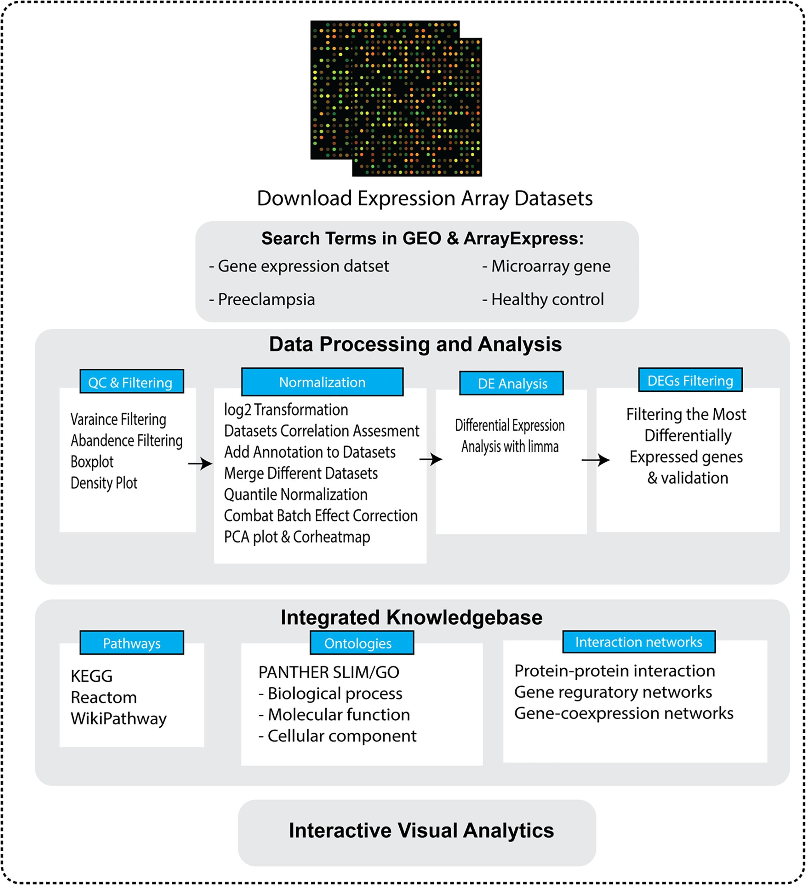
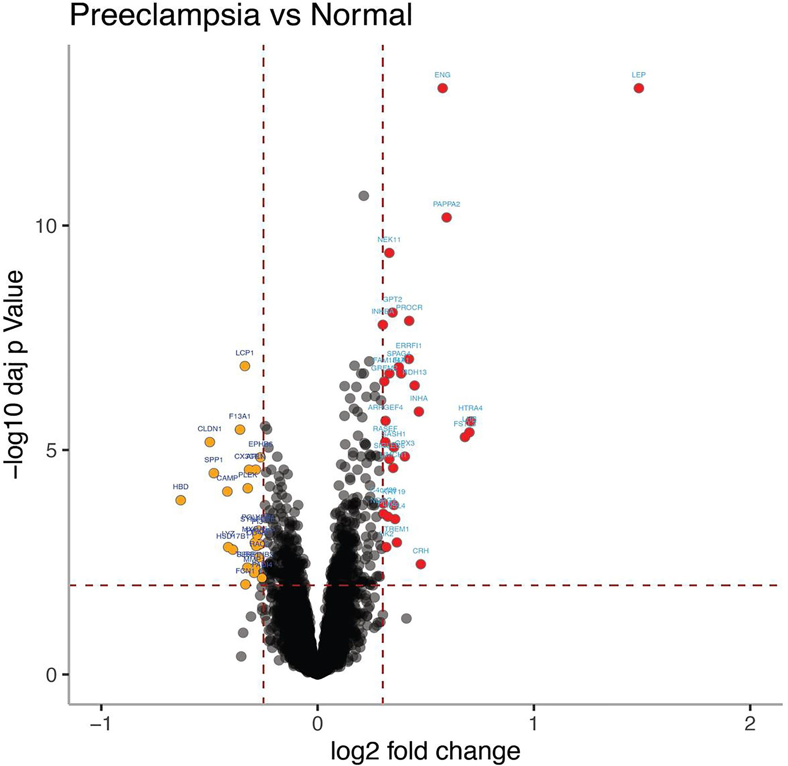

# IUMS_MSc_Human_Genetics

A repository for uploading datasets and publicly available R scripts used in publications by me at the Medical Genetics Department at IUMS from 2017-2020.

## Projects

### 1. Genetic Diagnosis in Maple Syrup Urine Disease (MSUD)
I worked on a genetic diagnosis project where we searched for pathogenic variants in patients with maple syrup urine disease (MSUD), which is a metabolic disorder. The relevant files for this project can be found in the [MSUD](MSUD/) directory.

**Abstract**

Maple syrup urine disease is the primary aminoacidopathy affecting branched-chain amino acid (BCAA) metabolism. The disease is mainly caused by the deficiency of an enzyme named branched-chained α-keto acid dehydrogenase (BCKD), which consist of four subunits (E1α, E1β, E2, and E3), and encoded by BCKDHA, BCKDHB, DBT, and DLD gene respectively. BCKD is the main enzyme in the catabolism pathway of BCAAs. Hight rate of autosomal recessive disorders is expected from consanguineous populations like Iran. In this study, we selected two sets of STR markers linked to the four genes, that mutation in which can result in MSUD disease. The patients who had a homozygous haplotype for selected markers of the genes were sequenced. In current survey, we summarized our recent molecular genetic findings to illustrate the mutation spectrum of MSUD in our country. Ten novel mutations including c.484 A > G, c.834_836dup CAC, c.357del T, and c. (343 + 1_344–1) _ (742 + 1_743–1)del in BCKDHB, c.355–356 ins 7 nt ACAAGGA, and c.703del T in BCKDHA, and c.363delCT/c.1238 T > C, c. (433 + 1_434–1) _ (939 + 1_940–1)del, c.1174 A > C, and c.85_86ins AACG have been found in DBT gene. Additionally, structural models of MSUD mutations have been performed to predict the pathogenicity of the newly identified variants.

#### Figures from the published paper

*Figure 1: Overview of the step-wise workflow for the expression array data meta-analysis. Selection process of eligible microarray datasets for meta-analysis of PE and Control. Depiction of the flow chart of the process involved in dataset integration and merge data analysis pipeline.*

*Figure 2: The volcano plot illustrates the up-regulated and down-regulated DEGs of the placenta across PEs and the healthy controls. The x-axis represents the log 2-fold change (FC), and the y-axis represents -log10 adjusted p-value.*

### 2. Gene Expression Analysis in Preeclampsia
I worked on a gene expression analysis project in preeclampsia, a multifactorial complex disorder affecting pregnant women. Preeclampsia is a pregnancy complication characterized by high blood pressure and signs of damage to another organ system, most often the liver and kidneys. Preeclampsia usually begins after 20 weeks of pregnancy in women whose blood pressure had been normal. Left untreated, preeclampsia can lead to serious, even fatal, complications for both the mother and the baby. We performed a meta-analysis of gene expression datasets to detect differentially regulated genes in the placenta. The relevant files for this project can be found in the [Preeclampsia](Preeclampsia/) directory.

**Abstract**

Preeclampsia (PE) is categorized as a pregnancy-related hypertensive disorder and is a serious concern in pregnancies. Several factors, including genetic factors (placenta gene expression, and imprinting), oxidative stress, the inaccurate immune response of the mother, and the environmental factors are responsible for PE development, but still, the exact mechanism of the pathogenesis has remained unknown. The main aim of the present study is to identify the gene expression signature in placenta tissue, to unveil disease etiology mechanisms.
The GEO, PubMed, and ArrayExpress databases have selected to identify gene expression datasets on placenta samples of both preeclampsia and the normotensive controls. A comprehensive gene expression meta-analysis of fourteen publicly available microarray data of preeclampsia disease has performed to identify gene expression signature and responsible biological pathways and processes. Using two different meta-analysis pipeline (in-house and INMEX) we have identified a total of 1234 differentially expressed genes (DEGs) with in-house method, including 713 overexpressed and 356 under-expressed genes whereas 272 DEGs (131 over and 141 under-expressed) have identified with INMEX, across PEs and healthy controls. Comprehensive functional enrichment and pathway analysis was performed by EnrichR library, whic revealed “Asparagine N-linked glycosylation Homo sapiens”, “Nef and signal transduction”, “Hemostasis”, and “immune system” among the most enriched terms. The present study sets out to explain a novel database of candidate genetic markers and biological pathways that play a critical role in PE development, which might aid in the identification of diagnostic, prognostic, and therapeutic informative molecules.

#### Figures from the published paper

*Figure 1: Overview of the step-wise workflow for the expression array data meta-analysis. Selection process of eligible microarray datasets for meta-analysis of PE and Control. Depiction of the flow chart of the process involved in dataset integration and merge data analysis pipeline.*

*Figure 2: The volcano plot illustrates the up-regulated and down-regulated DEGs of the placenta across PEs and the healthy controls. The x-axis represents the log 2-fold change (FC), and the y-axis represents -log10 adjusted p-value.*

## Publications
1. Hassan Saei, Ali Govahi, Ameneh Abiri, Maryam Eghbali, Maryam Abiri,
Comprehensive transcriptome mining identified the gene expression signature and differentially regulated pathways of the late-onset preeclampsia, Pregnancy Hypertension, 2021. PMID: 34098523 DOI: 10.1016/j.preghy.2021.05.007.
2. Abiri, M., Saei, H., Eghbali, M. et al. Maple syrup urine disease mutation spectrum in a cohort of 40 consanguineous patients and insilico analysis of novel mutations. Metab Brain Dis 34, 1145–1156 (2019). PMID: 31119508, DOI: 10.1007/s11011-019-00435-y (Abiri, M. and Saei, H. contributed equally to this work).